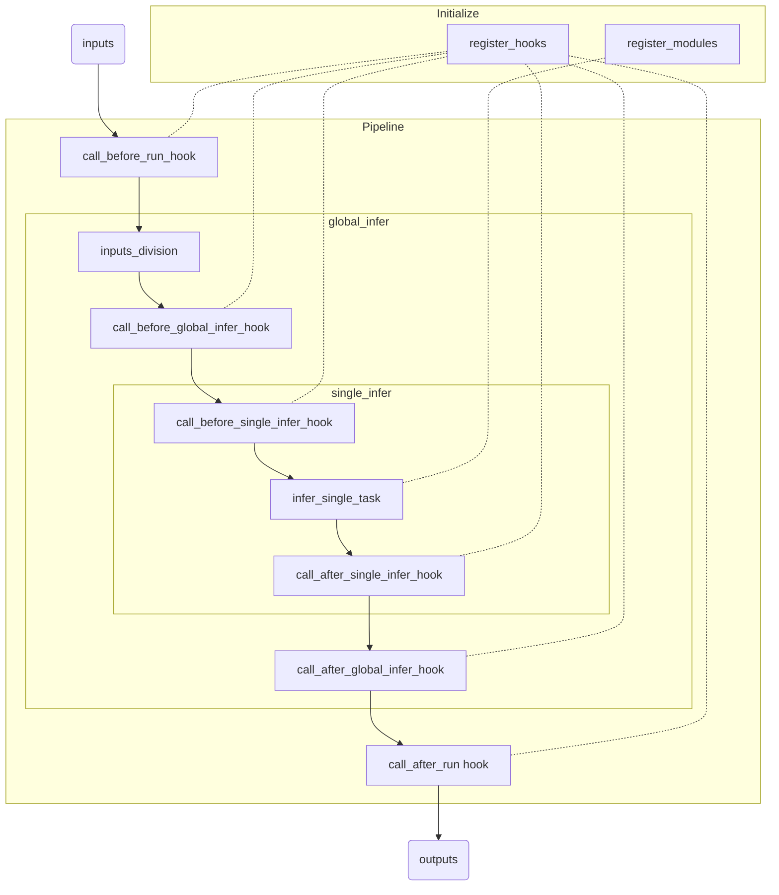

### Mario 说明文档

Mario 是用于整合各个子模块到生产环境的 Pipeline 框架

#### 当前 Pipeline 问题

- 不同项目 Pipeline 有相似结构但业务代码繁重难以复用
- 无穷无尽的异常处理
- 长周期项目业务逻辑杂糅，代码难以维护
- 子模块为了保证模块化需要精心维护
- 缺少网络调用接口

#### 框架作用

| 作用                                       | 描述                                                         |
| ------------------------------------------ | ------------------------------------------------------------ |
| 集成多种任务运行方式                       | 支持顺序、多进程、多线程运行方式                             |
| 处理异常                                   | 开发人员专注于业务逻辑，由框架捕获异常                       |
| 划分 Pipeline 运行阶段，用 Hook 做中间处理 | 将数据输入到结果输出流程划分为 `before_run`->`before_global_infer`->`before_single_infer`->`after_single_infer`->`after_global_infer`->`after_run` 几个阶段，每个节点可以配置带优先级的 Hook 来执行任务<br />逻辑清晰，代码模块化，易于维护 （可能会略微降低不熟悉框架的开发人员的代码可读性） |
| 支持子模块注册机制                         | 子模块注册后作为全局变量便于随时引用                         |
| 支持 http 调用服务                         | 为了和界面软件端解耦，支持 http 调用 pipeline                |
| 超时跳过当前任务                           | 可以设置任务超时时间                                         |

#### Mario 架构

##### Pipeline 运行流程



#### 使用方法

1. 将 Mario 加为项目子模块，继承 Pipeline

> pipeline.py

```python
from .mario import Pipeline

class MtPipeline(Pipeline):
	pass
```

2. 重载函数

```python
def initialize(self, gpu_id):
	# prepare modules
	self.register_module(...)

def infer_single_task(self, inputs):
	# important func
	result = inputs + 1
	return result

def global_exception_result(self, exception_str, inputs):
	return 'global_exception'

def single_exception_result(self, exception_str, inputs):
	return 'single_exception'
```

3. 根据业务逻辑构建 Hooks

> hooks.py

```python
from .mario import Hook

class HelloHook(Hook):
    def after_run(self, pipeline, databus):
        print('Hello after_run!')

class HiHook(Hook):
	def before_single_infer(self, pipeline, databus):
		print('Hi before_single_infer!')

...
```

4. 构建 Pipeline

```python
from .pipeline import MtPipeline
from .hooks import *

def build_pipline(gpu_id=0, debug=False, running_mode='multithreading', developer_mode=False, http_mode=False, timeout=None):
    pipeline = MtPipeline(gpu_id=gpu_id, debug=debug, running_mode=running_mode, developer_mode=developer_mode, 
    pipeline.register_hook(HelloHook(), priority=80)
    pipeline.register_hook(HiHook(), priority=200)
    return pipeline
```

5. 生成实例，执行任务

```python
pipeline = build_pipline(developer_mode=True, running_mode='sequence', debug=True, timeout=None)
results = pipeline.infer(inputs)
```

